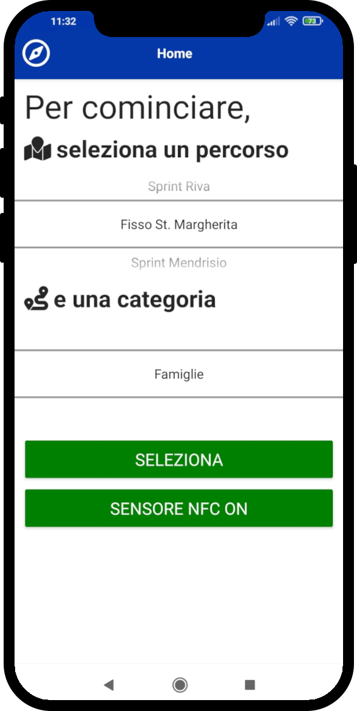
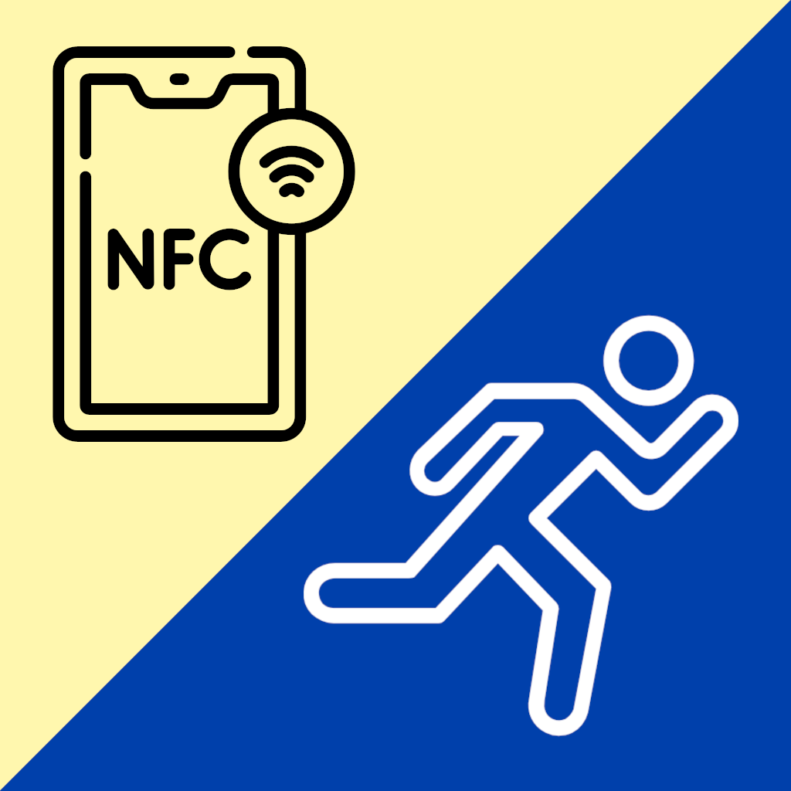

# WirO

### WirO is a mobile phone application which allows recording Orienteering runs, or other types of sport runs, using a smartphone and NFC tags. The app records split and total times and uses NFC tags to check stations passage. Runs are synchronized with a server which shows auto-results.

If you are interested in developing further this app, you're welcome! 

> At the moment the app is localized in _italian_, but this will change (hopefully) asap!

- This apps uses the framework @nativescript https://github.com/NativeScript/NativeScript
- Other libraries used are:
  - https://plugins.nativescript.rocks/plugin/@nativescript/template-drawer-navigation
  - https://market.nativescript.org/plugins/nativescript-nfc/
  - https://market.nativescript.org/plugins/nativescript-vibrate/
